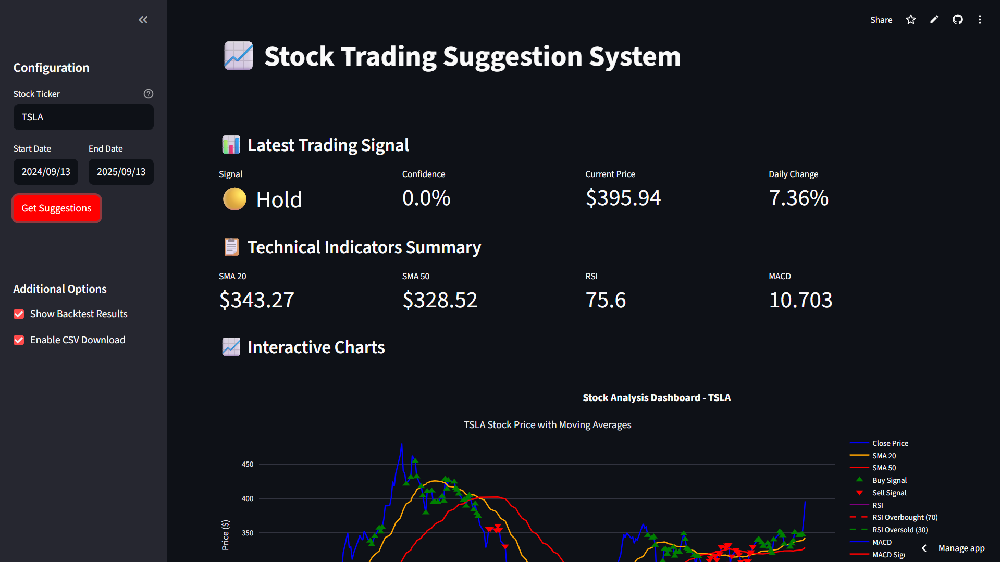
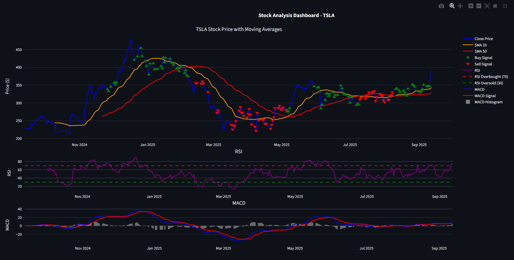
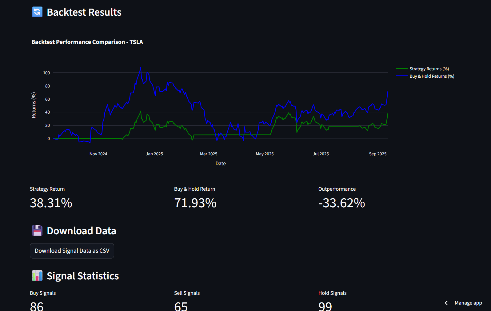
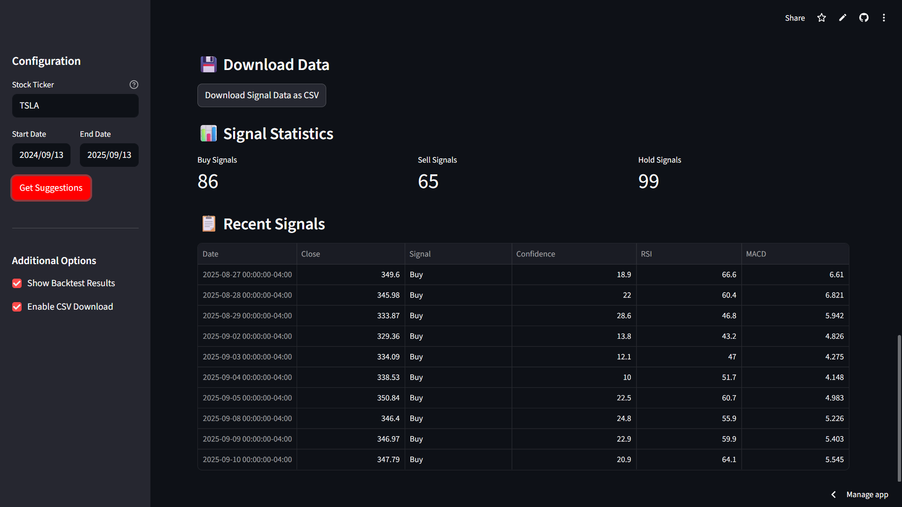

# 📈 Stock Trading Suggestion System

<p align="center">
  
</p>

An **AI-powered technical analysis web app** that provides **Buy / Sell / Hold** trading suggestions based on **SMA, RSI, and MACD indicators**.  
Built with **Streamlit** and **yfinance** to fetch real-time stock market data.

---

## 🚀 Live Demo
🔗 [Try the app here](https://stock-suggestion-romil.streamlit.app/)

---

## ✨ Features
- ✅ Fetches **real-time & historical stock data** (via `yfinance`)
- ✅ Technical Indicators: **SMA (20/50), RSI, MACD**
- ✅ Smart **Buy / Sell / Hold signals** with confidence score
- ✅ **Interactive candlestick chart** with overlays & signal markers
- ✅ Separate plots for **RSI** and **MACD**
- ✅ Downloadable **signal data (CSV)**
- ✅ Simple **backtest simulation** with cumulative returns chart
- ✅ **Clean & modern UI** built with Streamlit

---

## 🛠️ Tech Stack
- **Python 🐍**
- **Streamlit** – Web App Framework  
- **yfinance** – Stock Market Data API  
- **Plotly** – Interactive Charts  
- **Pandas / Numpy** – Data Analysis  

---

## 📸 Screenshots
### 🔹 RSI & MACD Plots


### 🔹 Backtest Results


### 🔹 Signals and More


---

## ⚡ How It Works
1. Enter a stock ticker (e.g., **AAPL**, **TSLA**, **RELIANCE.NS**)  
2. Select a date range  
3. Click **Get Suggestions**  
4. View the latest **Buy / Sell / Hold recommendation** with confidence score  
5. Explore **interactive charts** and **backtest results**  
6. Download data as **CSV**  

---

## 📂 Installation (Run Locally)

Clone the repo:
```bash
git clone https://github.com/romilmonpara/stock-suggestion.git
cd stock-trading-suggestion
```

## 📂 Installation
Install dependencies:
```bash
pip install -r requirements.txt
```

```bash
streamlit run app.py
```

## 👨‍💻 Author  
**Romil Monpara**

🔗 [Portfolio](https://romilmonpara.netlify.app/)  
🐙 [GitHub](https://github.com/romilmonpara)  
💼 [LinkedIn](https://www.linkedin.com/in/romilmonpara)

## ⭐ Star this repo if you find it useful! ⭐
